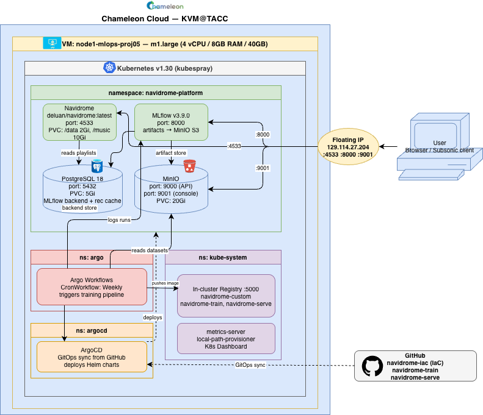

# Architecture

## Platform Overview

---

## Resource Requirements

| Service | CPU req | CPU limit | Mem req | Mem limit | Storage |
|---|---|---|---|---|---|
| Navidrome | 100m | 500m | 256Mi | 512Mi | 2Gi + 10Gi PVC |
| MLflow | 200m | 1000m | 1Gi | 2Gi | MinIO (S3) |
| PostgreSQL | 100m | 500m | 256Mi | 1Gi | 5Gi PVC |
| MinIO | 100m | 500m | 256Mi | 1Gi | 20Gi PVC |

> Evidence: run `kubectl top pods -n navidrome-platform` on Chameleon after load.
